<script src="https://cdn.mathjax.org/mathjax/latest/MathJax.js?config=TeX-AMS-MML_HTMLorMML" type="text/javascript"></script>

[back to main page](https://michael-hoffman.github.io)
# Bayesian Model Evaluation and Comparison
## SPS Modeling of Compact Dwarf Galaxies
### Michael Hoffman, Charlie Bonfield, Patrick O'Brien


## Introduction

Stellar population synthesis models are valuable tools for determining how
stellar evolution leads to the galaxy characteristics we observe in nature.  In
light of the recent gravitational wave discovery by LIGO, it is important to
properly model the frequency and behavior of binary stars.  By determining the
best places to look for massive binary progenitors (and thus potential LIGO
event binary black holes), scientists can better predict the frequency of future
gravitational wave detections.  The goal of this project is to compare stellar
population synthesis models with and without binary star evolution and
investigate how these compare with observed data for dwarf galaxies in the
RESOLVE survey.  We will determine the likelihood of models from BPASS by
comparing broadband magnitudes to those from RESOLVE using a Bayesian approach,
resulting in estimates of various parameters (age, metallicity, binary fraction, mass fraction ) after marginalization. We will also provide galaxy mass estimates
using a method mirroring the one used in the RESOLVE survey. Through careful
analysis of our results, we hope to determine how significant a role binary
stars play in the evolution of dwarf galaxies, thereby telling us where to point
(or not to point) our gravitational wave detectors in the future!

### Code Acknowledgements
Conversion from SPS model fluxes to broadband magnitudes heavily based on IDL
code provided by S. Kannappan.

The project members would also like to acknowledge those who created/maintain
numpy, pandas, and any other python packages used in this code.

### Databases
1. RESOLVE: Eckert et al., *Astrophysical Journal*, 810, 166 (2015).
2. BPASSv2: Stanway et al., *Monthly Notices of the Royal Astronomical Society*,
456, 485 (2015).
   BPASSv1: Eldridge & Stanway, *Monthly Notices of the Royal Astronomical
Society*, 400, 1019 (2009).  
   *The project members would also like to acknowledge NeSI Pan Cluster, where
the code for BPASS was run.*


### Table of Contents
1. Loading the Data  
   (1.1) RESOLVE Data  
   (1.2) BPASS (Binary Population and Spectral Synthesis Code) Data
       (1.2a) Model Parameters
2. Model Calculations  
   (2.1) Fraction of Massive Binary Black Holes  
   (2.2) Normalization and Chi-Squared  
   (2.3) Galaxy-Specific Calculations
       (2.3a) Computing the Model-Weighted Parameters for Each Galaxy
       (2.3b) Mass Comparison with RESOLVE
       (2.3c) Cross-Validation and the Stellar Mass Function
       (2.3d) Galaxy Parameters as a Function of Binary Fraction
   (2.4) Bayesian Analysis
       (2.4a) Priors
       (2.4b) Likelihood Function
       (2.4c) Marginalization
3. Method Comparison  
   (3.1) Simple Random Sampling  
   (3.2) Metropolis-Hastings Algorithm  
   (3.3) Slice Sampling and NUTS (Failures)  
4. Fraction of Massive Binary Black Holes  
5. Discussion of Results  
6. References

# 1. Loading the Data

## (1.1) RESOLVE Data

To compare BPASS models with real data, we will be using broadband magnitude
measurements for dwarf galaxies in the RESOLVE survey. (The unit conversion and
data analysis will be outlined in a later section.) First, we download a csv
containing all of the RESOLVE data, opting to have all the data at our disposal
initially before selecting only the columns necessary for our calculations. To
accomplish this task, we run the following SQL query on the private RESOLVE data
site:

```select where name != "bunnyrabbits"```

We use pandas to convert this to a single, centralized DataFrame.  With pandas,
we are able to easily select out the columns for `name`, `grpcz` (for
calculating distance), `logmstar`, and eight magnitudes and their uncertainties.
The bands used in our analysis are those which are included in both the BPASS
models and RESOLVE (J, H, K, u, g, r, i, z).

```python
# Import statements 
import numpy as np
import pandas as pd
import matplotlib
matplotlib.use('Agg')
import matplotlib.pyplot as plt
from astroML.plotting import hist
from astroML.plotting import scatter_contour
import seaborn as sns
import sampyl as smp
from sklearn.neighbors import KernelDensity
import astropy.stats
import scipy.stats as ss
import corner
import random
import time
from IPython.display import Image

# set font rendering to LaTeX 
from astroML.plotting import setup_text_plots
setup_text_plots(fontsize=12, usetex=True)

%matplotlib inline

pd.set_option('display.max_columns', None)

# Read in the full RESOLVE dataset. 
resolve_full = pd.read_csv('resolve_all.csv')

# Select only parameters of interest.
resolve = resolve_full[['name','cz','grpcz','2jmag','2hmag','2kmag','umag',
                        'gmag','rmag','imag','zmag','e_2jmag','e_2hmag','e_2kmag',
                        'e_umag','e_gmag','e_rmag','e_imag','e_zmag','logmstar']]
resolve.to_pickle('resolve.pkl')

# Pickle DataFrame for quick storage/loading.
resolve_data = pd.read_pickle('resolve.pkl')

# Display RESOLVE data. 
resolve_data.head()
```
<div>
<table border="1" class="dataframe">
  <thead>
    <tr style="text-align: right;">
      <th></th>
      <th>name</th>
      <th>cz</th>
      <th>grpcz</th>
      <th>2jmag</th>
      <th>2hmag</th>
      <th>2kmag</th>
      <th>umag</th>
      <th>gmag</th>
      <th>rmag</th>
      <th>imag</th>
      <th>zmag</th>
      <th>e_2jmag</th>
      <th>e_2hmag</th>
      <th>e_2kmag</th>
      <th>e_umag</th>
      <th>e_gmag</th>
      <th>e_rmag</th>
      <th>e_imag</th>
      <th>e_zmag</th>
      <th>logmstar</th>
    </tr>
  </thead>
  <tbody>
    <tr>
      <th>0</th>
      <td>rf0001</td>
      <td>6683.8</td>
      <td>6683.8</td>
      <td>15.84</td>
      <td>-99.00</td>
      <td>-99.00</td>
      <td>18.64</td>
      <td>17.69</td>
      <td>17.32</td>
      <td>17.15</td>
      <td>17.05</td>
      <td>0.24</td>
      <td>-99.00</td>
      <td>-99.00</td>
      <td>0.04</td>
      <td>0.03</td>
      <td>0.04</td>
      <td>0.02</td>
      <td>0.12</td>
      <td>8.51</td>
    </tr>
    <tr>
      <th>1</th>
      <td>rf0002</td>
      <td>6583.8</td>
      <td>6583.8</td>
      <td>14.53</td>
      <td>14.27</td>
      <td>12.72</td>
      <td>18.62</td>
      <td>17.08</td>
      <td>16.33</td>
      <td>15.94</td>
      <td>15.67</td>
      <td>0.09</td>
      <td>0.29</td>
      <td>0.44</td>
      <td>0.03</td>
      <td>0.02</td>
      <td>0.02</td>
      <td>0.02</td>
      <td>0.02</td>
      <td>9.57</td>
    </tr>
    <tr>
      <th>2</th>
      <td>rf0003</td>
      <td>5962.9</td>
      <td>5962.9</td>
      <td>15.33</td>
      <td>14.72</td>
      <td>14.35</td>
      <td>18.89</td>
      <td>17.72</td>
      <td>17.07</td>
      <td>16.78</td>
      <td>16.51</td>
      <td>0.11</td>
      <td>0.11</td>
      <td>0.09</td>
      <td>0.03</td>
      <td>0.02</td>
      <td>0.02</td>
      <td>0.02</td>
      <td>0.03</td>
      <td>8.99</td>
    </tr>
    <tr>
      <th>3</th>
      <td>rf0004</td>
      <td>6365.9</td>
      <td>6365.9</td>
      <td>13.24</td>
      <td>13.09</td>
      <td>14.11</td>
      <td>16.20</td>
      <td>15.20</td>
      <td>14.61</td>
      <td>13.80</td>
      <td>14.27</td>
      <td>0.51</td>
      <td>0.15</td>
      <td>0.98</td>
      <td>0.03</td>
      <td>0.02</td>
      <td>0.03</td>
      <td>0.03</td>
      <td>0.09</td>
      <td>9.67</td>
    </tr>
    <tr>
      <th>4</th>
      <td>rf0005</td>
      <td>5565.4</td>
      <td>5565.4</td>
      <td>11.48</td>
      <td>10.75</td>
      <td>10.54</td>
      <td>15.90</td>
      <td>14.21</td>
      <td>13.40</td>
      <td>13.00</td>
      <td>12.73</td>
      <td>0.05</td>
      <td>0.13</td>
      <td>0.06</td>
      <td>0.05</td>
      <td>0.02</td>
      <td>0.02</td>
      <td>0.02</td>
      <td>0.02</td>
      <td>10.67</td>
    </tr>
  </tbody>
</table>
</div>

To select dwarf galaxies from the RESOLVE dataset, we use the following criteria:

* Galaxy stellar mass less than \\(10^{9.5} M_{\odot}\\) (`logmstar` < 9.5)

(This is the threshold scale and was recommended by Dr. Kannappan in a private correspondence.)

Now, our DataFrame is reduced to only the columns we need: eight magnitudes and their uncertainties, as well as `name`, `logmstar`, and `grpcz`.

```python
# Select the dwarf galaxies.
resolve = resolve_data[(resolve_data['logmstar'] < 9.5)]

print 'Number of galaxies in RESOLVE matching our dwarf galaxy criterion: ', resolve.shape[0]
```

    Number of galaxies in RESOLVE matching our dwarf galaxy criterion:  1657

Missing photometric data in RESOLVE is indicated by `-99`. Since we do not wish to include these values in our subsequent data analysis, we treat them by ignoring all instances of `-99`. We also exclude data from these bands when comparing to our BPASS model fluxes.

*We perform this process externally, but the relevant code has been extracted from our pipeline and is shown below.*  

```python
errs =[]
    for eband in emag_list:
        if (gal[eband] != -99.0):
            errs.append(gal[eband])
    num_good_values = len(errs)

    # add 0.1 mag to all errors Kannappan (2007)
    errs = np.array(np.sqrt(np.array(errs)**2 + 0.1**2))

    gmags = []
    for gband in rmag_list:
        if (gal[gband] != -99.0):
            gmags.append(gal[gband])
gmags = np.array(gmags)
```
## (1.2) BPASS (Binary Population and Spectral Synthesis Code) Data  

BPASS is a stellar population synthesis (SPS) modeling code that models stellar populations that include binary stars.   This is a unique endeavor in that most SPS codes do not include binary star evolution, and it makes BPASS well-suited for our hunt for massive binaries in RESOLVE dwarf galaxies.

**Advantages:  **
1. Includes data for separate SPS models for populations of single and binary star populations.  
2. Data files are freely available and well-organized.  
3. Both spectral energy distributions (SEDs) and broadband magnitudes are available. 

**Disadvantages:  **
1. Cannot provide any input to the code - you are stuck with the provided IMF slopes, ages, and metallicities.  
    * In the context of our project, this means that our model grid has already been defined.  
2. Binary star populations are not merged with single star populations - you have to mix the two on your own.  
    * We will be mixing binary and single star populations in varying proportions.

We read in all of the data from the BPASS models and store it as a pandas DataFrame. <br/>

### (1.2a) Model Parameters

We have three parameters from BPASS that characterize each model:

- Age: 1 Myr (\\(10^6\\) years) to 10 Gyr (\\(10^{10}\\) years) on a logarithmic scale
    - Stored as `log(Age)`, ranging from 6.0 to 10.0.
- Metallicity: \\(Z = 0.001, 0.002, 0.003, 0.004, 0.006, 0.008, 0.010, 0.014, 0.020, 0.030, 0.040\\)
    - Stored as: `Metallicity`
- IMF Slopes (for ranges of \\(M_{*}\\) in units of \\(M_{\odot}\\)):  
    - \\(0.1 < M_{\textrm{galaxy}} < 0.5\\): -1.30, -2.35
        - Stored as: `IMF (0.1-0.5)`
    - \\(0.5 < M_{\textrm{galaxy}} < 100\\): -2.0, -2.35, -2.70
        - Stored as: `IMF (0.5-100)`
    - \\(100 < M_{\textrm{galaxy}} < 300\\): 0.0, -2.0, -2.35, -2.70 
        - Stored as: `IMF (100-300)`
                
We will also be calculating a fourth parameter, \\(f_{MBBH}\\), to go along with each model, which we will discuss in further detail below. 

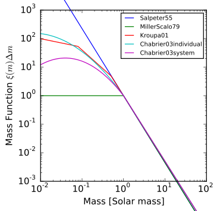


The image above shows a number of popular initial mass functions. The BPASS initial mass functions most closely resemble `Kroupa01`, in that we have three linear functions that are defined over different mass ranges and stitched together at the boundaries of each interval. We believe this to be a practical choice of IMF, and it is simple to integrate later on in the code to determine $f_{MBBH}$.  

**Note: The BPASS models that we use contain a single simple stellar population** (delta-function burst in star formation at time zero). We predict that this will limit the degree to which the models match the observed data, and we believe incorporating models with continuous star formation (which are available from BPASS) represents an area of further study.  

*Due to the nature of the data (there are many BPASS data files placed in a set of seven folders), we perform this process externally and pickle the resulting DataFrame. For the interested members of the audience, the data files may be found under "BROAD-BAND COLOURS - UBVRIJHKugriz" at http://bpass.auckland.ac.nz/2.html. Locally, we have stored these files in our `DataRepo` folder.* 

```python
# ind: number of IMF slope combinations (number of blue links on BPASS website)
for i in range(len(ind)):
        
    os.chdir('/afs/cas.unc.edu/classes/fall2016/astr_703_001/bonfield/group_project/
              BPASS_mags/BPASSv2_'+ind[i]+'/OUTPUT_POP/'+key+'/')
    # print os.getcwd()     # check that we are moving through directories
        
    dat_files = glob.glob('*.dat')
    mod1,mod2,mod3,mod4,mod5,mod6,mod7 = [],[],[],[],[],[],[]
    df_sub = [mod1, mod2, mod3, mod4, mod5, mod6, mod7]
    df1,df2,df3,df4,df5,df6,df7,df8,df9,df10,df11 = [],[],[],[],[],[],[],[],[],[],[]
    df_arr = [df1, df2, df3, df4, df5, df6, df7, df8, df9, df10, df11]
        
    df_sub[i] = pd.DataFrame()
    
    for j in range(len(dat_files)):
            
        bpass = np.genfromtxt(dat_files[j],delimiter='',dtype=float)
        # pull out metallicity from data file name (start/stop are index positions)
        if key == 'binary':
            start = 13
            stop = 16
        elif key == 'single':
            start = 9
            stop = 12
        metallicity = float(dat_files[j][start:stop])/1000.
            
        age = bpass[:,0]
        metallicity = metallicity*np.ones(len(age))
        imf_1 = imf1[i]*np.ones(len(age))         
        imf_2 = imf2[i]*np.ones(len(age))         
        imf_3 = imf3[i]*np.ones(len(age))
            
        df_arr[j] = pd.DataFrame()            
            
        df_arr[j]['IMF (0.1-0.5)'] = pd.Series(imf_1)
        df_arr[j]['IMF (0.5-100)'] = pd.Series(imf_2)
        df_arr[j]['IMF (100-300)'] = pd.Series(imf_3)
        df_arr[j]['Metallicity'] = pd.Series(metallicity) 
        df_arr[j]['log(Age)'] = pd.Series(age)
        df_arr[j]['u'] = pd.Series(bpass[:,10])
        df_arr[j]['g'] = pd.Series(bpass[:,11])    
        df_arr[j]['r'] = pd.Series(bpass[:,12])    
        df_arr[j]['i'] = pd.Series(bpass[:,13])
        df_arr[j]['z'] = pd.Series(bpass[:,14])
        df_arr[j]['J'] = pd.Series(bpass[:,7])
        df_arr[j]['H'] = pd.Series(bpass[:,8])
        df_arr[j]['K'] = pd.Series(bpass[:,9])
```


```python
# Read in the BPASS model data 
bpass_single = pd.read_pickle('bpass_sin_mags.pkl')
bpass_binary = pd.read_pickle('bpass_bin_mags.pkl')

# Display data frame for binary models as example 
bpass_binary.head()
```

<div>
<table border="1" class="dataframe">
  <thead>
    <tr style="text-align: right;">
      <th></th>
      <th>IMF (0.1-0.5)</th>
      <th>IMF (0.5-100)</th>
      <th>IMF (100-300)</th>
      <th>Metallicity</th>
      <th>log(Age)</th>
      <th>u</th>
      <th>g</th>
      <th>r</th>
      <th>i</th>
      <th>z</th>
      <th>J</th>
      <th>H</th>
      <th>K</th>
    </tr>
  </thead>
  <tbody>
    <tr>
      <th>0</th>
      <td>-1.3</td>
      <td>-2.0</td>
      <td>-2.0</td>
      <td>0.001</td>
      <td>6.0</td>
      <td>-16.72410</td>
      <td>-15.25659</td>
      <td>-14.97677</td>
      <td>-14.81755</td>
      <td>-14.64745</td>
      <td>-14.35990</td>
      <td>-14.23688</td>
      <td>-14.12323</td>
    </tr>
    <tr>
      <th>1</th>
      <td>-1.3</td>
      <td>-2.0</td>
      <td>-2.0</td>
      <td>0.001</td>
      <td>6.1</td>
      <td>-16.89995</td>
      <td>-15.43458</td>
      <td>-15.15283</td>
      <td>-14.99264</td>
      <td>-14.82397</td>
      <td>-14.54499</td>
      <td>-14.42667</td>
      <td>-14.31568</td>
    </tr>
    <tr>
      <th>2</th>
      <td>-1.3</td>
      <td>-2.0</td>
      <td>-2.0</td>
      <td>0.001</td>
      <td>6.2</td>
      <td>-17.12357</td>
      <td>-15.66747</td>
      <td>-15.39094</td>
      <td>-15.23271</td>
      <td>-15.06762</td>
      <td>-14.79439</td>
      <td>-14.68084</td>
      <td>-14.57534</td>
    </tr>
    <tr>
      <th>3</th>
      <td>-1.3</td>
      <td>-2.0</td>
      <td>-2.0</td>
      <td>0.001</td>
      <td>6.3</td>
      <td>-17.60489</td>
      <td>-16.40239</td>
      <td>-16.45614</td>
      <td>-16.59758</td>
      <td>-16.69958</td>
      <td>-16.89289</td>
      <td>-17.24655</td>
      <td>-17.36608</td>
    </tr>
    <tr>
      <th>4</th>
      <td>-1.3</td>
      <td>-2.0</td>
      <td>-2.0</td>
      <td>0.001</td>
      <td>6.4</td>
      <td>-17.63741</td>
      <td>-16.54304</td>
      <td>-16.77804</td>
      <td>-17.05414</td>
      <td>-17.24676</td>
      <td>-17.56112</td>
      <td>-18.00511</td>
      <td>-18.15740</td>
    </tr>
  </tbody>
</table>
</div>


# 2. Model Calculations

For each model under consideration, we have *four* parameters that provide us with our model grid for BPASS:   

- Age
- Metallicity
- IMF Slopes (proxy for \\(f_{MBBH}\\))
- \\(\alpha\\) (binary fraction) : 0.0, 0.1, 0.2, 0.3, 0.4, 0.5, 0.6, 0.7, 0.8, 0.9, 1.0
    - We mix the BPASS models in a manner such that \\(\alpha\\) of our population is binary stars, while \\((1-\alpha)\\) 
      is single stars. 

```python
# combine magnitudes based on alpha (binary fraction)
def combine_mags(single,binary,alpha):
    
    single = np.array(single)
    binary = np.array(binary)
    return -2.5 * np.log10((alpha * 10**(-0.4*binary))+(1. - alpha) * (10**(-0.4*single))) 
```

Each combination of these parameters defines a unique model with a set of model magnitudes. We must first scale these values to put ourselves on the same footing as our RESOLVE galaxies, with the normalization providing an estimate of the galaxy mass. Before we do, however, we will discuss how we compute \\(f_{MMBH}\\). 

## (2.1) Fraction of Massive Binary Black Holes

The fundamental science question that we address in this project pertains to the fraction of massive binary black holes in dwarf galaxies (\\(f_{MBBH}\\)) that would be massive enough to emit gravitational waves that could be detected by Earth-based gravitational wave detectors. For each model, we can calculate this parameter using the BPASS initial mass functions and alpha parameter.

We define the following piecewise function for the initial mass functions from BPASS:

$$
IMF(M_*) = 
   \begin{cases} 
      aM_* + C_1, & 0.1M_{\odot} \lt M_* \lt 0.5M_{\odot} \\
      bM_* + C_2, & 0.5M_{\odot} \lt M_* \lt 100M_{\odot} \\
      cM_* + C_3, & 100M_{\odot} \lt M_* \lt 300M_{\odot} 
   \end{cases},
$$

where \\((a,b,c)\\) are the IMF slopes in the corresponding intervals (provided by BPASS) and \\((C_1,C_2,C_3)\\) are unknown constants.

Making use of the mass normalization condition (all IMFs are normalized to \\(10^6 M_{\odot}\\)) and boundary conditions, we are able to solve for the unknown constants. Once the system is solved, we can integrate the first moment of the IMF from \\(90M_{\odot}\\) (progenitor cutoff is from Belczynski et al.) to \\(300M_{\odot}\\) in order to find the fraction of (potential) massive binary black holes in our binary star population. To find \\(f_{MBBH}\\) (which is the fraction of massive binary black holes in the *total* population), we merely multiply the result from evaluating the integral under the curve by the binary fraction, \\(\alpha\\).

In summary, we walk away with \\(f_{MBBH}\\) for each unique combination of IMF slopes and alpha (70).

```python
"""
Function to calculate fraction of massive progenitors in binaries. 
Uses IMF slopes and alpha (binary fraction). The numerator is the integral 
of the binary IMF integrated from 90 M_sun (massive progenitor cutoff from 
Belczynski et. al. 2016) through 300 M_sun. The denominator is the 
normalized mass of the model (10^6 M_sun). 
"""
def fbin_calc(alpha, a, b, c):
    import scipy
    
    def intercept2(a, b, c):
        return ((1./(0.5*(300.**2-0.1**2)))*(10**6 - (1./3.)*a*(0.5**3 - 0.1**3) - (1./3.)*b*(100**3 - 0.5**3) 
               - (1./3.)*c*(300**3 - 100**3) - (b-a)*0.5*(0.5*(0.5**2-0.1**2)) - (b-c)*(100.0)*(0.5*(300**2-100**2))))
    
    def imf2(x):
        return (b*x + yint2)*alpha
        
    def imf3(x):
        return (c*x + yint3)*alpha

    yint2 = intercept2(a, b, c)
    yint1 = (b-a)*(0.5) + yint2
    yint3 = (b-c)*(100.) + yint2
    
    a1 = float(scipy.integrate.quad(imf2, 90, 100)[0])
    a2 = float(scipy.integrate.quad(imf3, 100, 300)[0])
    
    f_bin = (a1+a2)/(10.**6)
    
    return f_bin
```

## (2.2) Normalization and Chi-Squared
- BPASS models are based on instantaneous formation of stars with a total mass of \\(10^6 M_{\odot}\\).
- Since galaxies in RESOLVE contain far more mass than \\(10^6 M_{\odot}\\), we must normalize. To do so, we assume that the uncertainties on the model magnitudes are Poissonian when converted to fluxes, then perform the normalization in flux units (this is the natural linear scale for light output).

```python
# convert RESOLVE absolute mags to fluxes
gfluxs = 10**(-0.4*gmags)

# upper - lower bound on flux error
hfluxs = 10**(-0.4*(gmags+errs))
lfluxs = 10**(-0.4*(gmags-errs))
errs = 0.5*(hfluxs - lfluxs)
```

We define the normalization to be the scale factor that minimizes \\({\chi}^2\\), where \\({x_i}\\) are the model fluxes, \\({d_i}\\) are the observed (RESOLVE) fluxes, \\({\epsilon_i}\\) are the observed (RESOLVE) uncertainties, and \\(i\\) is the band index. We display the result below:  

$$c = \frac{\sum{\frac{x_i d_i}{\epsilon_i^2}}}{\sum{\frac{x_i^2}{\epsilon_i^2}}} $$  

- After normalizing the model fluxes with this factor, we compute \\({\chi}^2\\) using normalized model magnitudes and observed magnitudes (with uncertainties) for each model.
- We later use \\({\chi}^2\\) to determine the posterior probability of each model for a given galaxy.

*The code for carrying out this process takes a bit of a long time to run, so we have extracted another block of code from our pipeline to demonstrate how we compute normalizations and \\({\chi}^2\\) values.* 

```python
# store useful strings in arrays for later
rmag_list = ['umag','gmag','rmag','imag','zmag','2jmag','2hmag','2kmag']
emag_list = ['e_umag','e_gmag','e_rmag','e_imag','e_zmag','e_2jmag','e_2hmag','e_2kmag']
bmag_list = ['u','g','r','i','z','J','H','K']

# compute interesting values for one galaxy
# parallelize at the individual galaxy level
numProcs = multiprocessing.cpu_count()

def out_calc(gal):
    # determine all the galaxy level variables
    # a few galaxies throw errors due to missing data
    # skip those with try - except statement
    try:
        # set scope of output_arr
        output_arr = []
        # extract error values from RESOLVE
        errs =[]
        for eband in emag_list:
            # only add good values to list
            if (gal[eband] != -99.0):
                errs.append(gal[eband])
        num_good_values = len(errs)

        # add 0.1 mag to all errors Kannappan (2007)
        errs = np.array(np.sqrt(np.array(errs)**2 + 0.1**2))

        # extract apparent RESOLVE magnitudes
        gmags = []
        for gband in rmag_list:
            # only add good values to list
            if (gal[gband] != -99.0):
                gmags.append(gal[gband])
        gmags = np.array(gmags)

        # distance to galaxy (grcz over cz due to additional corrections)
        distance = gal['grpcz'] / (70. / 10**6)

        # convert RESOLVE apparent magnitudes to absolute magnitudes
        gal_abs_mags = gmags - 5.0*np.log10(distance/10.0)
        gmags = gal_abs_mags

        # convert RESOLVE absolute mags to fluxes
        gfluxs = 10**(-0.4*gmags)

        # upper - lower bound on flux error
        hfluxs = 10**(-0.4*(gmags+errs))
        lfluxs = 10**(-0.4*(gmags-errs))
        errs = 0.5*(hfluxs - lfluxs)

        # loop over binary fraction
        for alpha in np.arange(0.0, 1.1, .1):
            # list of absolute magnitude vectors
            mags = combine_mags(bpass_single[bmag_list[:num_good_values]], bpass_binary[bmag_list
                               [:num_good_values]],alpha)
            # set arrays for normilaztion and chi-square
            norms = np.zeros(len(mags))
            chi2 = np.zeros(len(mags))
            for k, mmags in enumerate(mags):
                # select mag vector for model and convert model mags to fluxes
                mfluxes = 10**(-0.4*mmags)
                # compute norm and chi-square
                norms[k] = np.sum((gfluxs*mfluxes)/errs**2)/np.sum((mfluxes/errs)**2)
                chi2[k] = np.sum((gfluxs-norms[k]*mfluxes)**2/errs**2)/num_good_values

                # extract model information (to be used later)
                imf1 = bpass_single.iloc[k]['IMF (0.1-0.5)']
                imf2 = bpass_single.iloc[k]['IMF (0.5-100)']
                imf3 = bpass_single.iloc[k]['IMF (100-300)']
                age = bpass_single.iloc[k]['log(Age)']
                metallicity = bpass_single.iloc[k]['Metallicity']
                output_list = [gal['name'], imf1, imf2, imf3, age, metallicity, alpha, norms[k],          
                               chi2[k],num_good_values]
                output_arr.append(output_list)
        print(output_list)
    except:
        print('A problem occured for %s' %gal['name'])

    return output_arr

pool = multiprocessing.Pool(numProcs-1)
# generate list of all dwarfs in RESOLVE for calculation
gal_list = [gal for index, gal in resolve.iterrows()]
output = pool.map(out_calc, gal_list)
# the output will be a list of lists of lists ordered by galaxy. Flatten to one giant list of lists
# each list is a model
merged = list(itertools.chain.from_iterable(output))
# convert to a dataframe for saving
df = pd.DataFrame(merged, columns = output_columns)
df.to_csv('all_output.csv', index=False)
```


```python
# Load in data for a couple of galaxies of choice. 
bpass = pd.read_csv('output_three.csv')
#
'''
# UNCOMMENT IF YOU WISH TO CALCULATE F_MBBH MANUALLY.

# Initialize array to store f_{MBBH} for each model.
fmbbh = np.zeros(len(bpass.index))

# Add a column to the data frame for f_{MBBH}. 
for index, row in bpass.iterrows():
    imf1 = row['IMF (0.1-0.5)']
    imf2 = row['IMF (0.5-100)']
    imf3 = row['IMF (100-300)']
    alpha_gal = row['Alpha']
    fmbbh[index] = fbin_calc(alpha_gal, imf1, imf2, imf3) 

bpass['f_{MBBH}'] = fmbbh
'''

bpass.head()
```
<div>
<table border="1" class="dataframe">
  <thead>
    <tr style="text-align: right;">
      <th></th>
      <th>Name</th>
      <th>IMF (0.1-0.5)</th>
      <th>IMF (0.5-100)</th>
      <th>IMF (100-300)</th>
      <th>log(Age)</th>
      <th>Metallicity</th>
      <th>Alpha</th>
      <th>Normalization</th>
      <th>Chi^2</th>
      <th>Good Bands</th>
    </tr>
  </thead>
  <tbody>
    <tr>
      <th>0</th>
      <td>rf0044</td>
      <td>-1.3</td>
      <td>-2.0</td>
      <td>-2.0</td>
      <td>6.0</td>
      <td>0.001</td>
      <td>0.0</td>
      <td>2.076575</td>
      <td>57.360405</td>
      <td>8</td>
    </tr>
    <tr>
      <th>1</th>
      <td>rf0044</td>
      <td>-1.3</td>
      <td>-2.0</td>
      <td>-2.0</td>
      <td>6.1</td>
      <td>0.001</td>
      <td>0.0</td>
      <td>1.790453</td>
      <td>57.377654</td>
      <td>8</td>
    </tr>
    <tr>
      <th>2</th>
      <td>rf0044</td>
      <td>-1.3</td>
      <td>-2.0</td>
      <td>-2.0</td>
      <td>6.2</td>
      <td>0.001</td>
      <td>0.0</td>
      <td>1.536136</td>
      <td>57.342386</td>
      <td>8</td>
    </tr>
    <tr>
      <th>3</th>
      <td>rf0044</td>
      <td>-1.3</td>
      <td>-2.0</td>
      <td>-2.0</td>
      <td>6.3</td>
      <td>0.001</td>
      <td>0.0</td>
      <td>1.068513</td>
      <td>52.654002</td>
      <td>8</td>
    </tr>
    <tr>
      <th>4</th>
      <td>rf0044</td>
      <td>-1.3</td>
      <td>-2.0</td>
      <td>-2.0</td>
      <td>6.4</td>
      <td>0.001</td>
      <td>0.0</td>
      <td>1.287277</td>
      <td>28.877582</td>
      <td>8</td>
    </tr>
  </tbody>
</table>
</div>
## (2.3) Galaxy-Specific Calculations

With the models defined, we can compute from the normalizations an estimate for \\(M_*, \alpha \\), metallicity, and age for each galaxy. In order to compare to the RESOLVE mass for each galaxy, we compute the median (as done by previous works, Kannappan and Gawiser 2007) and the median weighted by the likelihood of each model (new approach?).

### (2.3a) Computing the Model-Weighted Parameters for Each Galaxy


```python
input_df = pd.read_csv('output_three.csv')

galaxy_names = np.unique(input_df['Name'])

# Define the weighted mean function.
def weighted_median(values, weights):
    ''' 
    Compute the weighted median of values list. 
    The weighted median is computed as follows:
    1- sort both lists (values and weights) based on values, then
    2- select the 0.5 point from the weights and return the 
       corresponding values as results.
    e.g. values = [1, 3, 0] and weights=[0.1, 0.3, 0.6], assuming 
         weights are probabilities.
         sorted values = [0, 1, 3] and corresponding sorted 
         weights = [0.6, 0.1, 0.3]. The 0.5 point on weight corresponds
         to the first item which is 0., so the weighted median is 0.
    '''

    # convert the weights into probabilities
    sum_weights = sum(weights)
    weights = np.array([(w*1.0)/sum_weights for w in weights])
    # sort values and weights based on values
    values = np.array(values)
    sorted_indices = np.argsort(values)
    values_sorted  = values[sorted_indices]
    weights_sorted = weights[sorted_indices]
    # select the median point
    it = np.nditer(weights_sorted, flags=['f_index'])
    accumulative_probability = 0
    median_index = -1
    while not it.finished:
        accumulative_probability += it[0]
        if accumulative_probability > 0.5:
            median_index = it.index
            return values_sorted[median_index]
        elif accumulative_probability == 0.5:
            median_index = it.index
            it.iternext()
            next_median_index = it.index
            return np.mean(values_sorted[[median_index, next_median_index]])
        it.iternext()

    return values_sorted[median_index]

# define galaxy independent variables
range_z = 0.04-0.001
range_logA = 10.0-6.0
priors = range_z**-1*range_logA**-1
dpz = range_z/11.0
dplA = range_logA/41.0
ages = np.array(input_df[ (input_df['Name'] == galaxy_names[0]) ]['log(Age)'])
Zs = np.array(input_df[ (input_df['Name'] == galaxy_names[0]) ]['Metallicity'])
alphas = np.array(input_df[ (input_df['Name'] == galaxy_names[0]) ]['Alpha'])

output_columns = ['Name', 'walpha', 'wage', 'wZ','median', 'wmean', 'wmedian','logmstar',
                  'diff', '%diff']

def analyze_mass(galaxy):
    """
    :param galaxy: name of galaxy from input_df
    :return: output_list
    """
    norms = np.array(input_df[ (input_df['Name'] == galaxy) ]['Normalization'])
    chis = np.array(input_df[ (input_df['Name'] == galaxy) ]['Chi^2'])
    # implement a scale factor for better numerical results. Same accros all galaxies
    chis = chis/10.0
    lnprobs = -0.5*chis + np.log(priors)
    probs = np.exp(lnprobs)
    logmstar = np.array(resolve[(resolve['name'] == galaxy)]['logmstar'])[0]
    ratios = norms
    logmass = np.log10(ratios*10**6)

    # calculate weighted values
    wmean = np.sum(np.exp(-chis*0.5)*logmass)/np.sum(np.exp(-chis*0.5))
    wmedian = weighted_median(logmass, probs/np.sum(probs))
    walpha = np.sum(np.exp(-chis*0.5)*alphas)/np.sum(np.exp(-chis*0.5))
    wage = np.sum(np.exp(-chis*0.5)*ages)/np.sum(np.exp(-chis*0.5))
    wZ = np.sum(np.exp(-chis*0.5)*Zs)/np.sum(np.exp(-chis*0.5))

    # generate output line
    output_list = [galaxy,walpha,wage,wZ,np.median(logmass),wmean,wmedian,
                   logmstar,logmstar-wmedian,((logmstar-wmedian)/logmstar)*100.0]
    
    print(output_columns)
    
    # output mass - probability plot
    fig, ax = plt.subplots(figsize=(8, 6))
    scatter_contour(logmass, probs, threshold=200, log_counts=True, ax=ax,
                    histogram2d_args=dict(bins=40),
                    plot_args=dict(marker=',', linestyle='none', color='black'),
                    contour_args=dict(cmap=plt.cm.bone))

    ax.set_xlabel(r'${\log M_*/M_{\odot}}$')
    ax.set_ylabel(r'${P(M)}$')
    
    # output alpha - probability plot
    fig, ax = plt.subplots(figsize=(8, 6))
    scatter_contour(alphas, probs, threshold=20, log_counts=False, ax=ax,
                histogram2d_args=dict(bins=40),
                plot_args=dict(marker=',', linestyle='none', color='black'),
                contour_args=dict(cmap=plt.cm.bone))

    ax.set_xlabel(r'${\alpha}$')
    ax.set_ylabel(r'${P(M)}$')
    
    return output_list

analyze_mass(galaxy_names[0])
```

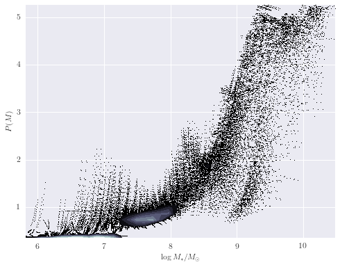

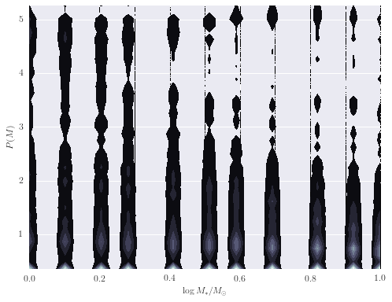

### (2.3b) Mass Comparison with RESOLVE
We have computed the percent difference between `logmstar` in RESOLVE and our weighted median calculation for all galaxies. We see the largest difference is 17%, but this is in a small tail of the distribution (if centered on zero), suggesting good agreement with RESOLVE. Results for age and metallicity are also as expected. **For the fraction of binaries, \\(\alpha\\), we see a narrow band centered around 40%.** This is an encouraging result, as it has been estimated that up to 70% of stars may be participating in binary interactions. Therefore, these models suggest SPS models would better fit galaxy spectra with a significant fraction of binary stars.

In exploring our data, we noticed that as the fraction of binary stars was increased, estimates for galaxy mass tended to increase as well. Eldridge and Stanway (2016) suggest supermassive binary black holes will only develop in very low metallicity environments. **While the weighted metallicity results are low in the range of these models, they are still too high to be strong candidates for these types of objects.**
```python
# load input data frame for each galaxy
massframe = pd.read_csv('galaxy_analysis.csv')

# extract interesting values to numpy arrays for graphing
masses = np.array(massframe['wmedian'])[:, np.newaxis]
resolve_masses = np.array(massframe['logmstar'])
diffs = np.array(massframe['%diff'])
walphas = np.array(massframe['walpha'])
wages = np.array(massframe['wage'])
wZs = np.array(massframe['wZ'])

# worst prediction
print('Largest percent difference in mass: %2.2f' %np.max(massframe['%diff']))

# distribution of differences with RESOLVE
plt.figure(figsize=(10, 6))
counts, bins, patches = hist(diffs, bins='knuth', color='orange', histtype='stepfilled', normed=False, alpha=0.5)
plt.xlabel("Percent Difference")
plt.ylabel("Number of Galaxies")
plt.title('Percent Difference in Mass between RESOLVE and BPASS Model')
#plt.show()

# distribution of weighted alphas
plt.figure(figsize=(10, 6))
counts, bins, patches = hist(walphas, bins='knuth', color='orange', histtype='stepfilled', normed=False, alpha=0.5)
plt.xlabel("Binary Fraction")
plt.ylabel("Number of Galaxies")
plt.title('Distribution of the Weighted Mean of Binary Fraction for All Dwarfs in RESOLVE')
#plt.show()

# distribution of weighted ages
plt.figure(figsize=(10, 6))
counts, bins, patches = hist(wages, bins='knuth', color='orange', histtype='stepfilled', normed=False, alpha=0.5)
plt.xlabel("log(Age) [Yr]")
plt.ylabel("Number of Galaxies")
plt.title('Distribution of the Weighted Mean of Age for All Dwarfs in RESOLVE')
#plt.show()

# distribution of weighted metallicities
plt.figure(figsize=(10, 6))
counts, bins, patches = hist(wZs, bins='knuth', color='orange', histtype='stepfilled', normed=False, alpha=0.5)
plt.xlabel("Metallicity")
plt.ylabel("Number of Galaxies")
plt.title('Distribution of the Weighted Mean of Metallicity for All Dwarfs in RESOLVE')
#plt.show()
```

    Largest percent difference in mass: 17.30


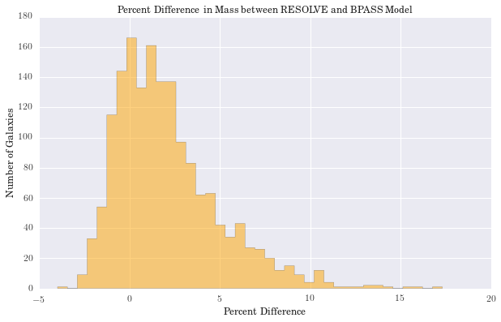


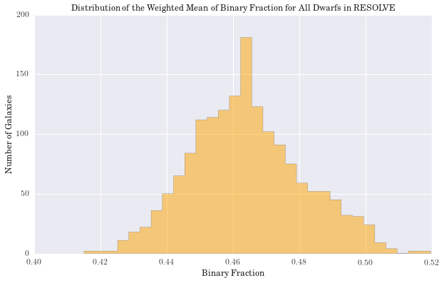


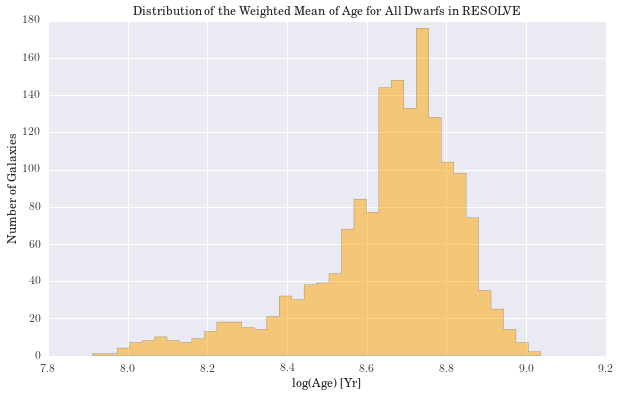


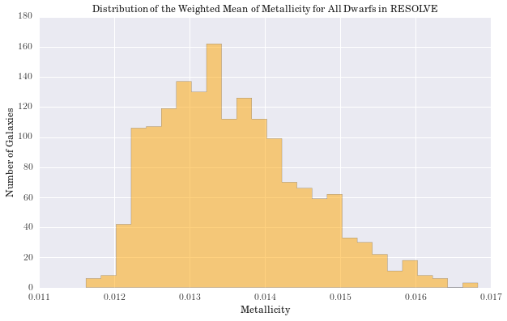


### (2.3c) Cross-Validation and the Stellar Mass Function

We have computed the stellar mass function of the dwarf galaxies in RESOLVE using Kernel Density Estimation. The bandwidth of the kernel was determined using k-fold cross-validation with k=15.

```python
# Perform k-fold cross-validation
mass_arr = masses[:,0]
np.random.shuffle(mass_arr)
mass_arr = mass_arr[:1650]

# determine Knuth's optimal bin size for the entire data set
knuthBinWidth = astropy.stats.knuth_bin_width(mass_arr)
print('The Knuth optimal bin width is: %f' % knuthBinWidth)
bandwidths = np.arange(0.4 * knuthBinWidth, 3.0 * knuthBinWidth, 0.01)

# split the data into 15 subsets
num_splits = 15
optimum_widths = np.zeros(num_splits)
kfold_arr = np.split(mass_arr, num_splits)

for run in range(num_splits):
    mask = np.ones(num_splits, dtype=bool)
    mask[run] = False
    test_data = kfold_arr[run]
    train_data = np.delete(kfold_arr, run, axis=0).flatten()

    logLs = np.zeros(bandwidths.size)
    for j, bandwidth in enumerate(bandwidths):
        # KDE
        kde = KernelDensity(kernel='gaussian', bandwidth=bandwidth).fit(train_data[:, np.newaxis])
        logLs[j] = kde.score(test_data[:, np.newaxis])
        optimum_widths[run] = bandwidths[np.argmax(logLs)]

widths = np.unique(optimum_widths)

print('------------RESULTS----------------------')
print('The median value of bandwidths is: %f' % np.median(optimum_widths))
print('The mean value of bandwidths is: %f' % np.mean(optimum_widths))
print('The std dev of bandwidths is: %f' % np.std(optimum_widths, ddof=1))
plt.figure(figsize=(10, 6))
counts, bins, patches = hist(optimum_widths, bins='knuth', color='orange', 
                             histtype='stepfilled', normed=False, alpha=0.5)
plt.xlabel("Optimum Bandwidth")
plt.ylabel("Frequency")
plt.title('Optimum Bandwidths from k-fold Cross-Validation (k=15)')
#plt.show()

# choose KDE bandwidth with k-fold median
kde = KernelDensity(kernel='gaussian', bandwidth=np.mean(widths)).fit(masses)
mass_plot = np.linspace(7.0,10,len(masses))[:, np.newaxis]
log_dens = kde.score_samples(mass_plot)
f = np.exp(log_dens)

plt.figure(figsize=(10, 6))
counts, bins, patches = hist(masses[:,0], bins='knuth', color='orange', histtype='stepfilled', 
                             label='DG SPS Model',normed=True, alpha=0.5)
counts, bins, patches = hist(resolve_masses, bins='knuth', color='purple', histtype='stepfilled', 
                             label='RESOLVE',normed=True, alpha=0.5)
plt.xlabel("log($M_{*}/M_{\odot}$)")
plt.ylabel("Normalized Number of Galaxies")
plt.legend(loc=2)
plt.title('Stellar Mass Function for Dwarf Galaxies in RESOLVE')
plt.plot(mass_plot[:,0], f, '-')
#plt.show()
```

	The Knuth optimal bin width is: 0.087364
    ------------RESULTS----------------------
    The median value of bandwidths is: 0.074946
    The mean value of bandwidths is: 0.099612
    The std dev of bandwidths is: 0.079988
    
    
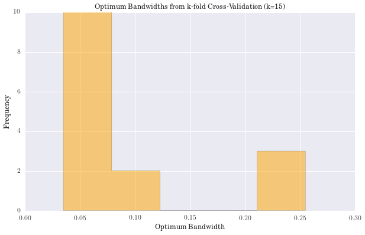


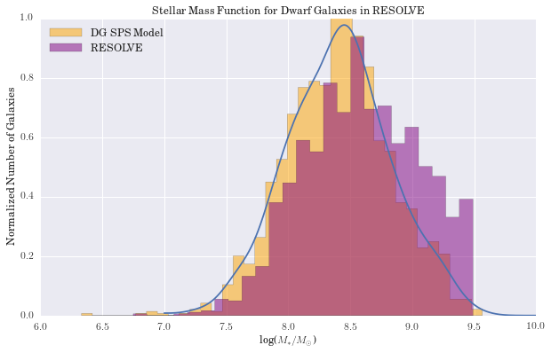


### (2.3d) Galaxy Parameters as a Function of Binary Fraction

To further investigate our fundamental question, we explored how our galaxy parameters behave as a function of the binary fraction (as opposed to \\(f_{MBBH}\\)). To do so, we chose three dwarf galaxies with different mass estimates from RESOLVE to capture what we felt was a representative (albeit small) picture of how our code runs for the entire sample.  

```python
# Load data for three galaxies.
df = pd.read_csv('output_three.csv')

# Select the galaxy names to loop over.
galaxy_names = np.unique(df['Name'])

# Do calculations for the first galaxy.
norms = df[ (df['Name'] == galaxy_names[0]) ]['Normalization']
chis = df[ (df['Name'] == galaxy_names[0]) ]['Chi^2']
range_z = 0.04-0.001
range_logA = 10.0-6.0
priors = range_z**-1*range_logA**-1
dpz = range_z/11.0
dplA = range_logA/41.0
lnprobs = -0.5*chis + np.log(priors)
probs = np.exp(lnprobs)
ages = df[ (df['Name'] == galaxy_names[0]) ]['log(Age)']
Zs = df[ (df['Name'] == galaxy_names[0]) ]['Metallicity']
alphas = df[ (df['Name'] == galaxy_names[0]) ]['Alpha']
cz = resolve[(resolve['name'] == galaxy_names[0])]['cz']
logmstar = resolve[(resolve['name'] == galaxy_names[0])]['logmstar']
ratios = norms
logmass = np.log10(ratios*10**6)

# Calculate mass difference as a function of alpha. 
def diff_alpha(gal_name, alphas=alphas):
    alphas = np.unique(alphas)
    wmalpha = np.zeros(len(alphas))
    diffs = np.zeros(len(alphas))
    metal = np.zeros(len(alphas))
    age = np.zeros(len(alphas))
    for k, alpha in enumerate(alphas):
        # dataframe centric structure
        temp = df[ (df['Name'] == gal_name) & (df['Alpha'] == alpha)]
        ntemp = len(temp)
        ptemp = np.zeros(ntemp)
        mtemp = np.zeros(ntemp)
        j = 0
        for index, row in temp.iterrows():
            mass = np.log10(row['Normalization']*10**6)
            lnprob = -0.5*row['Chi^2'] + np.log(priors)
            prob = np.exp(lnprob)
            ptemp[j] = prob
            mtemp[j] = mass
            j += 1

        mtemp = pd.Series(mtemp)
        ptemp = pd.Series(ptemp)

        temp = temp.assign(mass = mtemp.values)
        temp = temp.assign(prob = ptemp.values)
        logmstar = resolve[(resolve['name'] == gal_name)]['logmstar']

        wmalpha[k] = np.sum(temp['prob']*temp['mass'])/np.sum(temp['prob'])
        diffs[k] = (wmalpha[k] - logmstar)/logmstar*100.0
        metal[k] = np.sum(temp['prob']*temp['Metallicity'])/np.sum(temp['prob'])
        age[k] = np.sum(temp['prob']*temp['log(Age)'])/np.sum(temp['prob'])
    return diffs,metal,age

run1 = diff_alpha(galaxy_names[0])
run2 = diff_alpha(galaxy_names[1])
run3 = diff_alpha(galaxy_names[2])

plt.figure(figsize=(8,6))
plt.scatter(np.unique(alphas), run1[0], s=60, c='g', alpha=0.5)
plt.scatter(np.unique(alphas), run2[0], s=60, c='orange', alpha=0.5)
plt.scatter(np.unique(alphas), run3[0], s=60, c='m', alpha=0.5)
plt.legend(galaxy_names, loc=2)
plt.xlabel("Binary Fraction")
plt.ylabel("Percent Difference")
plt.title('Percent Mass Difference as a Function of Binary Fraction')

plt.figure(figsize=(8,6))
plt.scatter(np.unique(alphas), run1[1], s=60, c='g', alpha=0.5)
plt.scatter(np.unique(alphas), run2[1], s=60, c='orange', alpha=0.5)
plt.scatter(np.unique(alphas), run3[1], s=60, c='m', alpha=0.5)
plt.legend(galaxy_names, loc=2)
plt.xlabel("Binary Fraction")
plt.ylabel("Metallicity")
plt.title('Metallicity as a Function of Binary Fraction')
plt.show()

plt.figure(figsize=(8,6))
plt.scatter(np.unique(alphas), run1[2], s=60, c='g', alpha=0.5)
plt.scatter(np.unique(alphas), run2[2], s=60, c='orange', alpha=0.5)
plt.scatter(np.unique(alphas), run3[2], s=60, c='m', alpha=0.5)
plt.legend(galaxy_names, loc=6)
plt.xlabel("Binary Fraction")
plt.ylabel("log(Age) [Yr]")
plt.title('log(Age) as a Function of Binary Fraction')
plt.show()
```


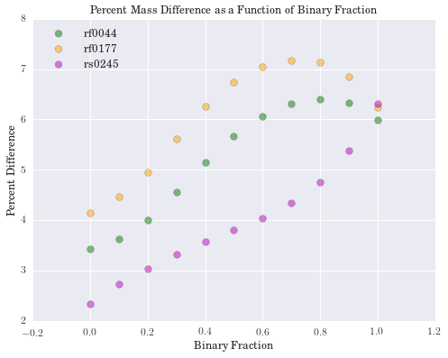


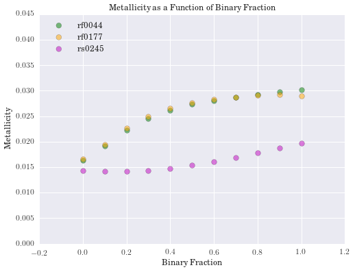


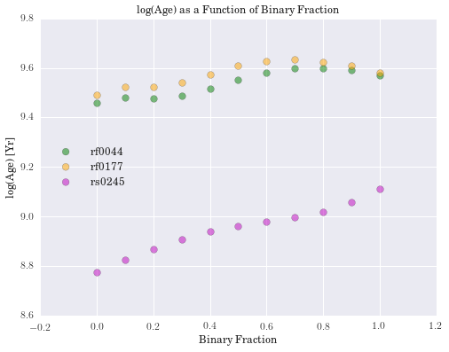

## (2.4) Bayesian Analysis

Up until this point, we have not performed any calculations that require any sort of formal Bayesian analysis. That is, we have not imposed priors on the model parameters with the hope of getting an idea of which ones are best for a given galaxy (nor have we discussed an appropriate likelihood function or performed any sort of marginalization). We include a brief discussion of each below, followed by code to demonstrate how this works for our sample galaxy.

### (2.4a) Priors

- IMF slopes: We do not claim to know anything about these parameters a priori, so we do not incorporate anything into our prior that pertains to IMF slopes. 
    - We will also not marginalize to capture the posterior distribution for these parameters. 
- Age: We impose a uniform prior on `log(Age)`, spanning the range of ages provided by BPASS. 
    - Although we could probably define a better prior here, we did not want to chop off any viable ages on accident.
- Metallicity: We impose a uniform prior on `Metallicity`, spanning the range of metallicities provided by BPASS. 
- Alpha: We impose a uniform prior on `alpha`, spanning the range of binary fractions that we test. 
    - Note: Since this is just one, we do not include it explicitly below. 

Our prior distribution is given below, where \\(\{{\theta}_i\}\\) represents our set of model parameters. 

$$p\left(\{{\theta}_i\}\right) = \frac{1}{\textrm{log(age) range}} \frac{1}{\textrm{metallicity range}}$$
